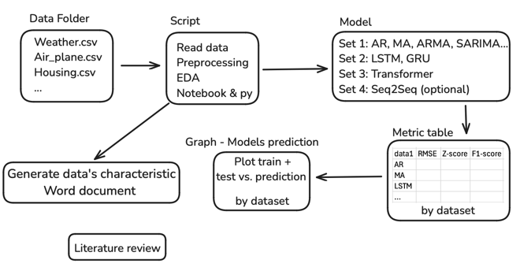

[//]: # (Note: Use Markdown Cheat Sheet if you need more functionality)

[//]: # (https://www.markdownguide.org/cheat-sheet/)

### Date: Sep 24 2024 
- Topics of discussion
    - The whole pipeline
  
    
    

- Action Items:

* [ ] Create a Data folder
* [ ] Script to read data and EDA (.py file and notebook)
* [ ] Word document - characteristics of data
* [ ] Model class(1. AR, MA...; 2. LSTM, GRU; 3. Transfomer;  4. Seq2Seq, optional)
* [ ] Metric class: table to compare RMSE, MSE...
* [ ] Metric graph: compare prediction vs. actual for models, by dataset
* [ ] Literature Review: what dataset other used; data's characteristics; any preprocessing; model selection; solve what problem

---
### Date: Oct 2 2024 
- Topics of discussion

|checked|unchecked|crossed|
|---|---|---|
|&check;|_|&cross;|
|&#x2611;|&#x2610;|&#x2612;|

- Action Items:
* [ ] Action Item 1
* [ ] Action Item 2
* [ ] Action Item 3
* [ ] Action Item 4
* [ ] Action Item 5
---
### Date: sep 24 2024 
- Topics of discussion

| Checkbox Experiments | checked header | crossed header |
| ---------------------|:--------------:|:--------------:|
| checkbox             |  &check; Row   |  &cross; row   |

- Action Items:
* [ ] Action Item 1
* [ ] Action Item 2
* [ ] Action Item 3
* [ ] Action Item 4
* [ ] Action Item 5
---
### Date: sep 24 2024 
- Topics of discussion

| Selection |        |
| --------- | ------ |
| &#x2610;  |

| Selection |        |
| --------- | ------ |
| &#x2611; |

- Action Items:
* [ ] Action Item 1
* [ ] Action Item 2
* [ ] Action Item 3
* [ ] Action Item 4
* [ ] Action Item 5
---
### Date: sep 24 2024 
- Topics of discussion

- Action Items:
* [ ] Action Item 1
* [ ] Action Item 2
* [ ] Action Item 3
* [ ] Action Item 4
* [ ] Action Item 5
---
### Date: sep 24 2024 
- Topics of discussion

- Action Items:
* [ ] Action Item 1
* [ ] Action Item 2
* [ ] Action Item 3
* [ ] Action Item 4
* [ ] Action Item 5
